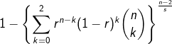
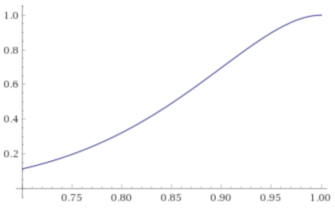
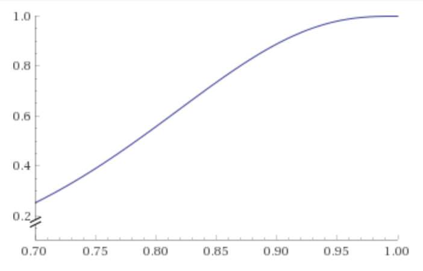

# Redundancy Protocol for a Player who have Potato internet


RPPP is a header-only library.  
This protocol greatly reduces the packet loss rate. It is especially effective in environments with low packet loss rates (almost all networks). 

This is especially useful for networks with high retransmission costs and for sequential applications where processing is blocked by loss.

### Data
If you use retransmission, can replace this
**Loss Occurrence Probability = Retransmission Occurrence Probability**

| Loss Probability /1data | Parity Length | Bandwidth Efficiency | | (Not use)Loss Occurrence Probability /100data | (RPPP)Loss Occurrence Probability /100data |
-|-|-|-|-|-
| 0.1% good   | 100 | 98% || 10%    | **0.016%**
| 0.2%        | 50  | 96% || 18%    | **0.032%**
| 0.4%        | 50  | 96% || 33%    | **0.24%**
| 0.7%        | 30  | 93% || 50%    | **0.49%**
| 1.5%        | 10  | 83% || 78%    | **0.67%**
| 2.0%        | 10  | 83% || 86%    | **1.5%**
| 3.0%        | 6   | 75% || 95%    | **2.2%**
| 4.0%        | 4   | 67% || 98%    | **2.9%**
| 5.0%        | 4   | 67% || 99%    | **5.4%**
| 8.0% so bad | 2   | 50% || 99.98% | **9.2%**

※Parity Length indicates how many packets redundant packets (2 packets) are added to. If you set 100, what is actually transmitted is 102 packets.  

```
n = Parity size (include parity packet)
r = Probability of not losing one packet (= 1 - loss rate)
s = Number of packets to send
```

Probability that one or more packets will be lost when `s` packets(arrive correctly probability = `r`) are transmitted.
And, 2 redundancy packets are generated per `n` packets.



### Probability Curve
Consider the case where redundancy is applied to 10 packets.

x axis = one packet loss rate
y axis = Loss Occurrence Probability

No redundancy |Simple parity|RPPP
-|-|-
||

### usage

1. `RPPP.hpp` exists at `./include/RPPP.hppp`
2. `#include "RPPP.hpp"`
3. you can write nice code.

### example code

```cpp
/* ENCODER CODE */

void sender(){
    SampleNetVar send_var;
    rppp::EncodeBuffer<SampleNetVar, 10> encoder;
    rppp::StreamData<SampleNetVar, 10> stream_data;

    // Encode 100 data and, Send 100 + parity data
    for(int i=0; i<100; i++){
        update(send_var);
        encoder.enq(send_var);
        while (encoder.deq(&stream_data) == rppp::Status::OK)
            send(&stream_data, sizeof(stream_data));
    }
}
```
```cpp
/* DECODER CODE */

void receiver(){
    SampleNetVar receive_var;
    rppp::DecodeBuffer<SampleNetVar, 10> decoder;
    rppp::StreamData<SampleNetVar, 10> stream_data;

    // receive 100 + parity data, and Decoder output 100 data
    for(;;){
        receive(&stream_data, sizeof(stream_data));
        decoder.enq(stream_data);
        if (decoder.deq(&receive_var) == rppp::Status::OK)
            use(receive_var);   
    }
}
```
example util
```cpp
#include "RPPP.hpp"
#include <iostream>

struct Position{
    int x;
    int y;
    int z;
};
struct Rotation{
    int x;
    int y;
    int z;
};
struct Scale{
    int x;
    int y;
    int z;
};

// the data what you want to send.
struct SampleNetVar{
    Position pos;
    Rotation rot;
    Scale sca;
    float health;
    uint16_t id;
};

void update(SampleNetVar &s){
    // some code for update a var.
}

void use(SampleNetVar &s){
    // some code for use a var.
}

void send(const void *data, size_t size){
    // some code for send.
}

void receive(const void *data, size_t size){
    // some code for receive.
}
```
